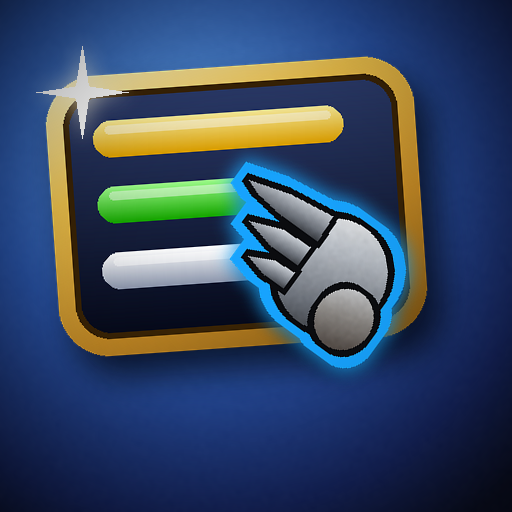
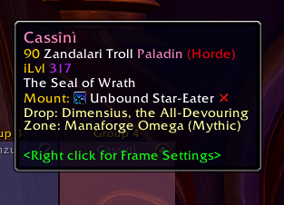
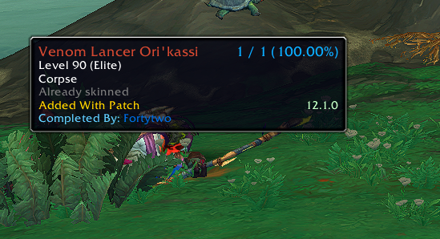
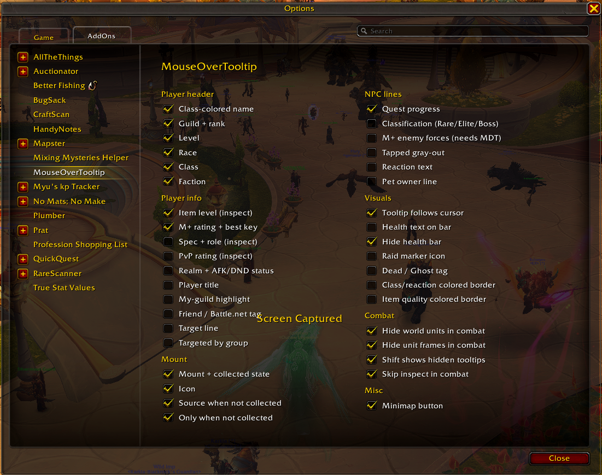

<h1 align="center">MouseOverTooltip</h1>

<b>The mouseover tooltip you already know, with the info you actually want, and nothing that slows your game down.</b>

## Why players install it

- **See what matters at a glance.** Item level, Mythic+ rating and best key, the mount they're riding, who they're targeting.
- **Quest mobs tell you what's left.** "6/10 Boar slain (4 left)", finished objectives in green.
- **It stays out of the way.** Blizzard's tooltip look, no extra frames, no libraries. Disabled options do no work at all.
- **Hide tooltips in combat** and hold Shift when you do want one.

Plays nice with other addons: the lines on the right come from AllTheThings.

## Settings

Options > AddOns > MouseOverTooltip, or type `/mot`. Every line can be turned on or off. The panel's **Defaults** button resets everything.

The minimap button opens the same panel; drag it to move it around the minimap.

## Game versions

Retail, Classic Era, TBC, Wrath, Cata, Mists Classic and WoW: Forever. Features a game version doesn't have (Mythic+, PvP rating, some inspect data) are hidden there.

## Performance

- No per-frame updates: the tooltip follows the cursor using the game's own anchoring.
- Other players are inspected at most once every 1.5 seconds, and results are kept for 5 minutes (up to 100 players, never saved to disk).
- Events are listened to only while they are needed.

## License

MIT
